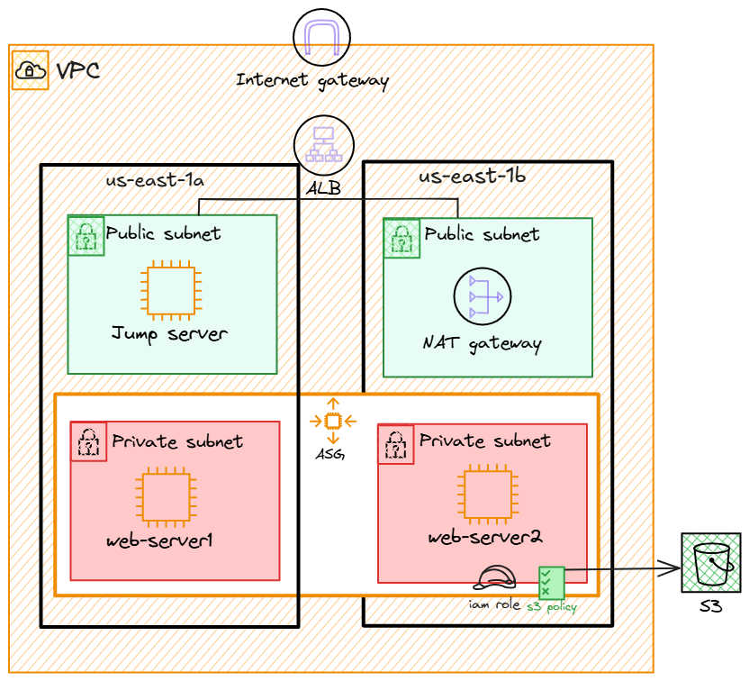
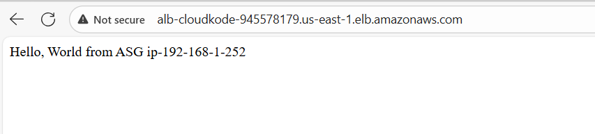
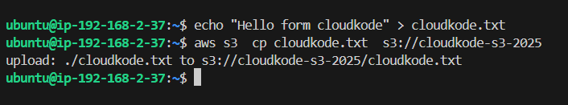

# 🚀 AWS Highly Available Web Infrastructure with Terraform


> **A production-ready, highly available AWS infrastructure deployed with Terraform, featuring Auto Scaling Groups, Application Load Balancer, and multi-AZ deployment.**

---

## 📋 Table of Contents

- [Overview](#-overview)
- [Architecture](#-architecture)
- [Features](#-features)
- [Prerequisites](#-prerequisites)
- [Quick Start](#-quick-start)
- [Infrastructure Components](#-infrastructure-components)
- [Deployment](#-deployment)
- [Testing](#-testing)
- [Security](#-security)
- [Cleanup](#-cleanup)

---

## 🎯 Overview

This project provisions a **secure, scalable, and highly available** web application infrastructure on AWS using Terraform. The infrastructure spans multiple Availability Zones (us-east-1a and us-east-1b) with automatic failover capabilities, load balancing, and secure access through a bastion host.

### **Key Highlights:**
- ✅ **Multi-AZ Deployment** for high availability
- ✅ **Auto Scaling** for dynamic workload management
- ✅ **Application Load Balancer** for traffic distribution
- ✅ **Bastion Host** for secure SSH access
- ✅ **NAT Gateway** for private subnet internet access
- ✅ **IAM Roles** for S3 integration
- ✅ **Infrastructure as Code** with Terraform

---

## 🏗️ Architecture




---

## ✨ Features

### **Networking**
- Custom VPC with public and private subnets across 2 AZs
- Internet Gateway for public internet access
- NAT Gateway for private subnet outbound connectivity
- Route tables with proper associations

### **Compute**
- Auto Scaling Group with launch template
- Min: 1, Max: 3, Desired: 2 instances
- Bastion host for secure SSH access
- Automated instance configuration via user data

### **Load Balancing**
- Application Load Balancer (ALB)
- Target Group with health checks
- HTTP listener on port 80

### **Security**
- Security groups for ALB, ASG, and Bastion
- IAM roles and policies for S3 access
- SSH key pair generation with Terraform
- Private key automatically saved locally

### **Storage**
- S3 bucket integration
- IAM policies for secure bucket access

---

## 📦 Prerequisites

Before you begin, ensure you have the following installed:

- **Terraform**
- **AWS CLI** configured with credentials
- **AWS Account** with appropriate permissions
- **SSH Client** for bastion host access

```bash
# Verify installations
terraform --version
aws --version
aws configure list
```

---

## 🚀 Quick Start

### **1. Clone the Repository**
```bash
git clone <your-repo-url>
cd <project-directory>
```

### **2. Initialize Terraform**
```bash
terraform init
```

### **3. Review Variables**
Edit `terraform.tfvars` to customize your deployment:
```hcl
region                 = "us-east-1"
vpc_cidr               = "192.168.0.0/16"
instance_type          = "t3.micro"
# ... other variables
```

### **4. Plan Deployment**
```bash
terraform plan
```

### **5. Apply Infrastructure**
```bash
terraform apply
```

Type `yes` when prompted to confirm the deployment.

---

## 🔧 Infrastructure Components

| Component | Count | Purpose |
|-----------|-------|---------|
| VPC | 1 | Network isolation |
| Public Subnets | 2 | Internet-facing resources |
| Private Subnets | 2 | Application instances |
| Internet Gateway | 1 | Public internet access |
| NAT Gateway | 1 | Private subnet outbound |
| Application Load Balancer | 1 | Traffic distribution |
| Auto Scaling Group | 1 | Dynamic scaling |
| Bastion Host | 1 | Secure SSH access |
| S3 Bucket | 1 | Object storage |
| Security Groups | 2 | Network security |

---

## 📤 Deployment

### **Step-by-Step Deployment:**

1. **Initialize Terraform Backend:**
   ```bash
   terraform init
   ```

2. **Validate Configuration:**
   ```bash
   terraform validate
   ```

3. **Preview Changes:**
   ```bash
   terraform plan
   ```

4. **Apply Configuration:**
   ```bash
   terraform apply -auto-approve
   ```
```

### **Important Outputs:**

After deployment, you'll receive:
- **ALB DNS Name**: Access your application
- **Bastion Public IP**: SSH access point
- **S3 Bucket Name**: Storage bucket identifier
- **Private Key Path**: SSH key location

---

## 🧪 Testing

### **1. Test Load Balancer**
```bash
# Get ALB DNS from outputs
ALB_DNS=$(terraform output -raw alb_dns_name)

# Test HTTP endpoint
curl http://$ALB_DNS

# Expected output: "Hello, World from ASG <hostname>"

```

### **2. Test Auto Scaling**
```bash
# Connect to bastion
ssh -i cloudkode-key.pem ec2-user@<bastion-ip>
nano cloudkode-key.pem
chmod 400 cloudkode-key.pem
# From bastion, connect to private instances
ssh -i cloudkode-key.pem ec2-user@<private-instance-ip>
```

### **3. Test S3 Access**
```bash
# From ASG instance
aws s3 ls s3://<bucket-name>
```

### **Screenshot Example:**



---

## 🔒 Security

### **Security Best Practices Implemented:**

✅ **Network Segmentation**: Public/private subnet isolation  
✅ **Bastion Host**: Jump server for SSH access  
✅ **Security Groups**: Least privilege access rules  
✅ **IAM Roles**: No hardcoded credentials  
✅ **Private Subnets**: Application layer isolated  
✅ **NAT Gateway**: Controlled outbound access  

### **Security Group Rules:**

**ALB/ASG Security Group:**
- Inbound: HTTP (80) from 0.0.0.0/0
- Inbound: SSH (22) from 0.0.0.0/0
- Outbound: All traffic

**Bastion Security Group:**
- Inbound: SSH (22) from 0.0.0.0/0
- Outbound: All traffic

---

## 🧹 Cleanup

To destroy all resources:

```bash
# Preview what will be destroyed
terraform plan 

# Destroy infrastructure
terraform destroy

# Confirm with 'yes' when prompted
```

**⚠️ Warning**: This action is irreversible. Ensure you have backups of any important data.

---


---


<div align="center">

**⭐ Star this repo if you find it helpful! ⭐**

Made with ❤️ by CloudKode

</div>